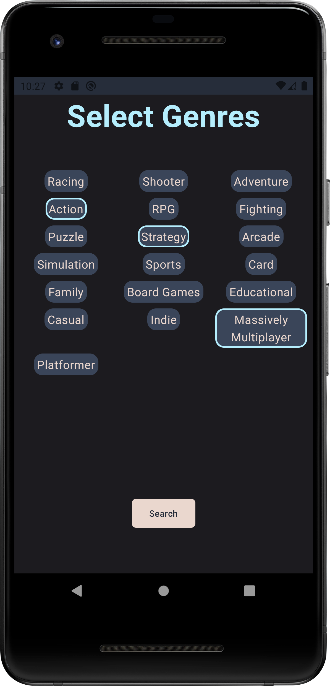
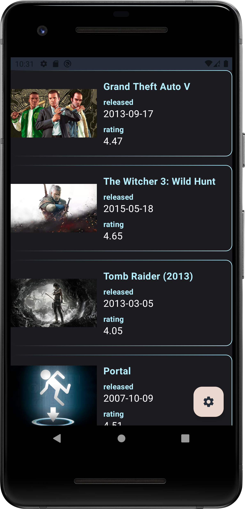
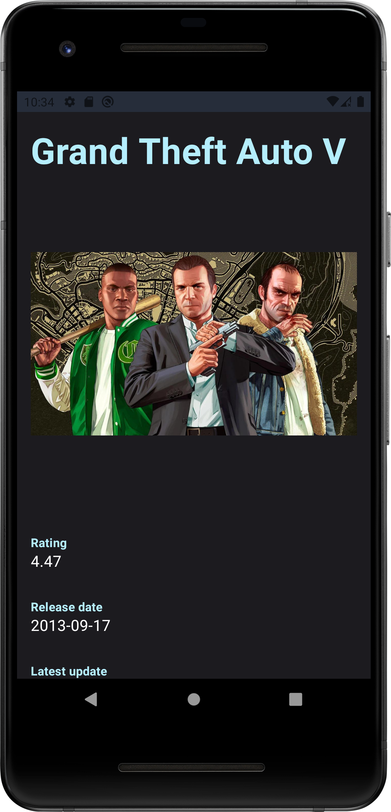
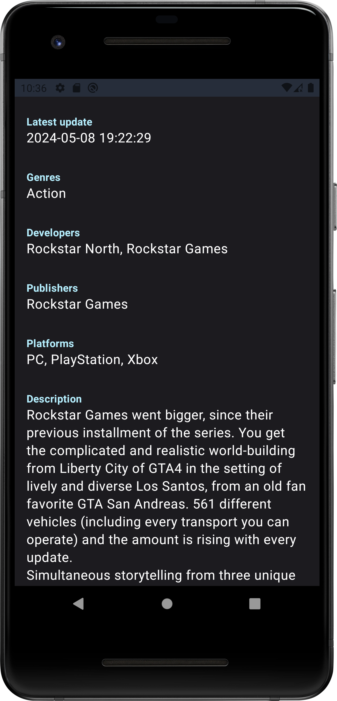

# GameApp

GameApp is a simple Android application designed to help users search for games based on their preferences. The app is built using Kotlin and Jetpack Compose, and utilizes the [RAWG API](https://rawg.io/apidocs)."

## Features

- *Onboarding Screen:* Allows users to select preferred game genres during the onboarding process.
- *Games Screen:* Enables users to search for games and view them in a list format.
- *Details Screen:* Provides detailed information about a specific game, including description, rating, and platforms.
- *Settings Screen:* The settings screen allows users to customize their preferred game genres similar to the onboarding screen. However, genres are loaded from a local database, indicating which genres are already selected by the user.

## Architecture and Libraries

The app follows the principles of Clean Architecture, with MVVM (Model-View-ViewModel) as the architectural pattern. Dependency injection is implemented using Dagger Hilt for better code organization and testability.

### Libraries Used:
- *Kotlin:* Main programming language used for app development.
- *Jetpack Compose:* Modern UI toolkit for building native Android UIs.
- *Retrofit:* HTTP client for making network requests to the RAWG API.
- *Dagger Hilt:* Dependency injection library for managing dependencies in Android apps.
- *Room:* A persistence library that provides an abstraction layer over SQLite to allow for more robust database access while harnessing the full power of SQLite.
- *Coil Compose:* Image loading library for Jetpack Compose, used for efficiently loading and displaying images in the app.
- *Compose Navigation:* Navigation library for Jetpack Compose, facilitating navigation between different composables within the app.
- *DataStore Preferences:* Data storage solution provided by Jetpack, used for storing key-value pairs in a persistent and efficient manner, replacing SharedPreferences.

## API Integration

GameApp fetches game data from the [RAWG API](https://rawg.io/apidocs), allowing users to access a vast database of games.

## Design

### Onboarding/Settings Screen
In the onboarding screen the items are displayed in a lazy grid layout, ensuring adaptability to different list sizes and screen dimensions. Each genre can be selected/deselected (indicated by a border) by click.
During the onboarding process, the genres are fetched from the server, resulting in all genre items being initially presented without any selection indication (borderless).
Clicking the search button triggers three actions: saving the onboarding completed status to DataStore preferences, persisting the selected genres along with their selection status to the Room database, and navigating to the games screen.
The Onboarding screen is reused for the Setttings, and the logic is separated within the OnboardingViewModel in the following way: 
- The genres are initially fetched from the local database
- If the database is empty the genres are fetched from the network

This ensures that the genres are only fetched from the network when needed (during the onboarding process).
If the user completes the onboarding process by clicking on the search button, the onboarding screen won't be displayed in the following app launches. Instead, the starting screen will be the "Games Screen".

### Games Screen
In the games screen, each item features the game's image (loaded with Coil), name, release date, and rating, providing users with essential information in a compact format for easy browsing and decision-making.
Clicking on a game item navigates users to the details screen, with additional information about the selected game.
The items are paginated with a default page size of 20. When the last displayed item is within a certain distance from the bottom of the LazyColumn, the app fetches a new page from the server.
The games screen includes a floating action button that navigates users to the settings screen.

### Details Screen
Upon launching the details screen, the app fetches the game details from the network, utilizing the game ID provided by game screen. The game image is displayed alongside additional information presented modularly using the DataPointComponent.

## Screenshots

